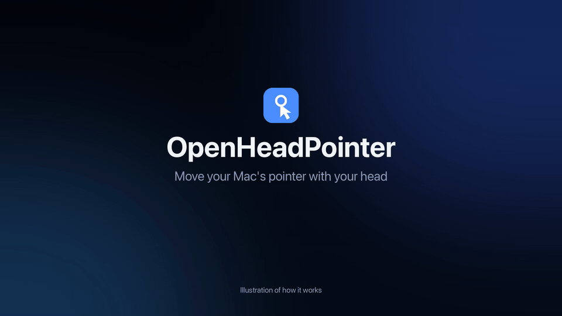

# OpenHeadPointer

[](https://ko-fi.com/F2J527ZLUN)

An open-source alternative to macOS Head Pointer: control the pointer with your face or eyes using an ordinary webcam. It's a native Swift menu-bar app built only on Apple frameworks (AVFoundation, Vision, SwiftUI) with no third-party dependencies. All processing happens on the Mac, and no video is stored or sent anywhere.



*Illustration of how it behaves, not a recording of the app.*

> **Prototype.** Expect rough edges. It needs a webcam and reasonable lighting.

## Install (prototype)

Download `OpenHeadPointer.dmg`, open it and drag OpenHeadPointer to Applications. The app isn't notarized, so macOS blocks the first launch: right-click the app → **Open** → **Open**. If macOS says the app is damaged, run `xattr -dr com.apple.quarantine /Applications/OpenHeadPointer.app` and open it again. Then grant Camera and Accessibility access when asked.

To make the installer yourself: `scripts/package.sh` → `dist/OpenHeadPointer.dmg` and `dist/OpenHeadPointer.zip`.

## Build and run

Requires macOS 15+ and Xcode (Swift 6).

```bash
scripts/build-app.sh          # → build/OpenHeadPointer.app
open build/OpenHeadPointer.app    # an eye icon appears in the menu bar
swift test                    # unit tests for the gaze maths
```

Build through the script rather than `swift run`. macOS grants camera and accessibility permissions to an app bundle, and without the bundle it would ask on behalf of your terminal instead.

### Permissions

- **Camera** is requested on first launch.
- **Accessibility** is needed to move and click the pointer. Grant it in System Settings → Privacy & Security → Accessibility.

> **Rebuilds and Accessibility:** builds are signed with a self-signed "OpenHeadPointer Dev" certificate from your login keychain, so the Accessibility grant survives rebuilds. Without it (ad-hoc signing), every rebuild looks like a new app. System Settings still shows the old grant as on, but it no longer applies. To fix that, run `tccutil reset Accessibility org.openheadpointer.OpenHeadPointer` and grant access again. To create the certificate yourself: Keychain Access → Certificate Assistant → Create a Certificate… with the name "OpenHeadPointer Dev", identity type "Self-Signed Root" and certificate type "Code Signing".

## Using it

Press ⌃⌥⌘G to turn control on and off. This hotkey is your off switch. Then move your head and the pointer follows.

The pointer is **speed-sensitive**, like mouse acceleration: it follows where your face is in the camera image, and head speed sets the gain. Move slowly for fine control and quickly to cross the screen. Small drift (breathing, sway) is ignored. No calibration is needed.

- **Speed** slider (0.1–0.7×) sets how far the pointer travels for a given head movement.
- **Long blink to click**: close both eyes for a moment. The **Blink time to click** slider (0.2–1.0 s) sets how long. Normal blinks are ignored.
- **Blink 3 times quickly** puts the pointer back in the screen centre (⌃⌥⌘R does the same).
- **Pause when I move the mouse**: control pauses while you use the mouse and resumes 1.5 s after you stop.
- **Show pointer dot** draws a dot on the pointer.
- **Camera Debug** (⌃⌥⌘V) shows what the tracker sees, and ⌃⌥⌘T records a 10-second trace.

### Tips

- Light your face evenly from the front. Avoid a bright window behind you.
- Glasses with strong reflections hurt tracking.
- macOS camera Reactions (gesture effects) run inside the camera pipeline on every frame. Turn them off from the green camera icon in the menu bar. The app can't switch them off itself.

### Experimental code (off in this build)

The repository also contains work that is switched off by `AppModel.minimal = true` in [AppModel.swift](Sources/OpenHeadPointer/AppModel.swift): eye tracking with a 13-dot calibration, head-turn and direct modes, dwell and mouth clicking, and probabilistic target prediction. Set `minimal` to `false` and rebuild to try it. It is untested in this release, and its menu items and hotkeys (such as ⌃⌥⌘C for calibration and ⌃⌥⌘D for dwell) only appear then.

## How it works (experimental pipeline)

This describes the full pipeline in the experimental code. The shipped face pointer uses only the Vision face landmarks, image registration of the face, and the speed-sensitive pointer in `GazeCore/HeadPointer.swift`.

```
Camera (AVFoundation, 720p, YUV)
  → Vision: face rectangle (yaw/pitch/roll) + 76-point landmarks (eye outlines, pupils)
  → IrisLocator: dark-pixel centroid inside each eye outline (refines Vision's coarse pupil)
  → EyeGeometry: iris offset relative to the eye corners, in eye widths (scale and roll invariant)
  → GazeMapper: ridge regression, quadratic in iris offset + head-pose terms → screen point
  → Fixation filter: averages within a fixation, jumps only when several frames agree
  → Target engine (probabilistic layout, below)
  → cursor move / dwell click / long-blink click (CGEvent), overlay dot
```

### Probabilistic layout (target prediction)

The Accessibility API reads every clickable element in the front window, and the elements near the gaze. Each element is a hypothesis, and an HMM keeps a posterior over them:

```
P(target | gaze, context)  ∝  P(gaze | target)  ×  habits(target)  ×  context(target)^trust
                              └ every frame ┘     └ your clicks ┘     └ semantic model ┘
```

- **Gaze likelihood:** the element's rectangle blurred by the gaze uncertainty (measured noise plus calibration error). Small targets give a sharp peak, large ones a broad one.
- **Habits:** element role × how often you click this element in this app (30-day half-life).
- **Context model:** pluggable (`SemanticPriorProvider`). It sees app, window, focused element and recent clicks, never the gaze, so the two factors are independent evidence. Shipped: Apple's on-device model.
- **Scoreboard:** every real mouse click scores each prior in bits gained over a uniform guess. Gaze clicks are excluded, since the prior steered them. This is how to choose between models. See the Camera Debug window.

The cursor snaps to the top element once it passes the snap threshold, and dwell then clicks its centre.

| Path | What's there |
| --- | --- |
| `Sources/GazeCore/` | Pure, unit-tested logic: features, regression, filters, dwell and blink detectors, iris locator |
| `Sources/OpenHeadPointer/Capture/` | Camera session and Vision face tracking |
| `Sources/OpenHeadPointer/Control/` | Cursor events, global hotkeys, screen coordinate conversion |
| `Sources/OpenHeadPointer/UI/` | Menu-bar panel, calibration window, gaze overlay, debug view |
| `Sources/OpenHeadPointer/AppModel.swift` | Connects the pipeline and holds the settings and state |

Calibration is saved to `~/Library/Application Support/OpenHeadPointer/calibration.json`.

## Ideas for next steps

- **Gaze + head hybrid:** use gaze to jump to a region and small head movements to fine-tune.
- **Snap to targets:** use the Accessibility API to snap the pointer to the nearest clickable element.
- **Better iris model:** a Core ML iris/gaze network (e.g. one trained on MPIIGaze) instead of the dark-centroid heuristic.
- **Continuous recalibration:** treat each confirmed click as a new calibration sample.
- **Multi-monitor:** calibrate each display separately and switch based on head yaw.

## Contributing and licence

See [CONTRIBUTING.md](CONTRIBUTING.md). Released under the [MIT licence](LICENSE).
